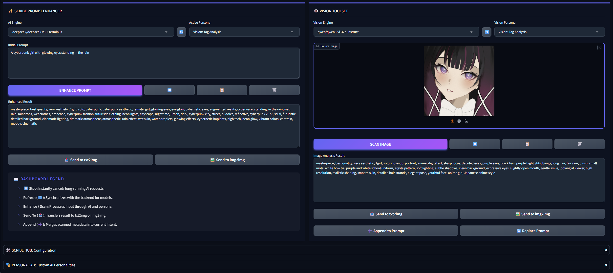

# 🖋️ ScribeNEO

A prompt engineering extension for Stable Diffusion Forge Neo. Enhance text prompts with AI, interrogate images with vision models, and manage custom personas — all from a single dashboard.

> [!IMPORTANT]
> **Compatibility:**
> Built and tested exclusively on [Forge Neo](https://github.com/Haoming02/sd-webui-forge-classic/tree/neo). May work on other Forge forks or A1111, but no support is provided for those environments.

---

## ✨ Features

### 🌪️ Prompt Enhancer
Type a rough idea, pick a persona, and let an LLM transform it into a detailed generation-ready prompt.
- **Prose Enhancer**: Expands keywords into rich, natural language descriptions.
- **Tag Specialist**: Converts ideas into Danbooru/e621 tag sequences.
- Results can be sent directly to **txt2img** or **img2img**.

### 👁️ Vision Toolset
Upload an image and scan it with a vision-capable model to extract prompts from existing artwork.
- **Descriptive Caption**: Outputs a detailed prose description of the image.
- **Tag Analysis**: Outputs a structured booru-style tag list.
- Results can be **appended** to or **replaced** in the enhancer input.

### 🎭 Persona Lab
Create, edit, and delete custom system prompts that shape how the AI interprets your intent. Four personas are included out of the box.

### 🛠️ Scribe Hub
Central configuration panel for managing provider connections.
- Switch between **OpenRouter**, **Hugging Face**, and **Ollama** providers.
- Test connections, save API keys, and edit endpoints.
- Use the **🔄 Sync** buttons on the Enhancer and Vision modules to fetch available models from the active provider.

---

## 🚀 Installation

1. Open your **Stable Diffusion WebUI** (Forge Neo).
2. Navigate to the **Extensions** tab → **Install from URL**.
3. Paste: `https://github.com/SiliconeShojo/ScribeNEO.git`
4. Click **Install** and restart the WebUI.

---

## 🗝️ Getting API Keys

| Provider | How to get a key |
|---|---|
| **OpenRouter** | Create an account and generate a key at [openrouter.ai/keys](https://openrouter.ai/keys). Gives access to Gemini, Claude, GPT-4o, and more. |
| **Hugging Face** | Generate an Access Token (read permissions) at [huggingface.co/settings/tokens](https://huggingface.co/settings/tokens). |
| **Ollama** | No key needed. Just run the Ollama server locally. |

---

## ☕ Support ScribeNEO

If ScribeNEO has enhanced your creative workflow, consider supporting its development!

---

## 📜 License
This project is released under the **MIT License**. See the [LICENSE](LICENSE) file for details.

---
*Made with 🤍 for the AI Art Community.*
